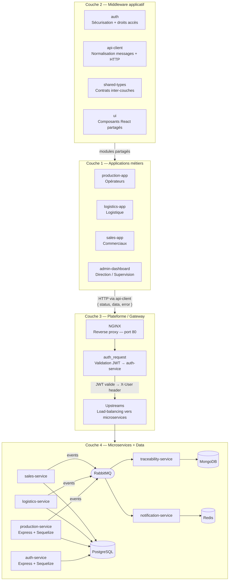

# Architecture Logicielle — Monorepo

Ce document décrit l'architecture SOA/Microservices à 4 couches du projet. Chaque section correspond à une couche définie dans le cahier des charges.

---

## Vue d'ensemble



---

## Structure du Monorepo

```
aeronexis-modular-erp/
├── apps/                        # Couche 1 : Applications métiers
│   ├── production-app/
│   ├── logistics-app/
│   ├── sales-app/
│   └── admin-dashboard/
├── packages/                    # Couche 2 : Middleware applicatif partagé
│   ├── auth/                    # Sécurisation flux locaux + gestion des droits
│   ├── api-client/              # Normalisation messages + couche HTTP
│   ├── shared-types/            # Contrats inter-couches (types, DTOs, interfaces)
│   └── ui/                      # Composants React réutilisables (QueryErrorAlert, etc.)
├── services/                    # Couches 3 & 4 : Plateforme + Microservices
│   ├── api-gateway/             # Couche 3 : NGINX (nginx.conf + Dockerfile)
│   ├── auth-service/            # Couche 4 : Express + Sequelize — JWT, RBAC
│   ├── production-service/      # Couche 4 : Express + Sequelize — Orders, Lots, Incidents
│   ├── logistics-service/       # Couche 4 : Stocks, réservations, expéditions
│   ├── sales-service/           # Couche 4 : Commandes clients, statistiques
│   ├── traceability-service/    # Couche 4 : Audit trail immuable (consommateur RabbitMQ)
│   └── notification-service/    # Couche 4 : Alertes temps réel (consommateur RabbitMQ)
├── infrastructure/
│   ├── docker/
│   │   └── docker-compose.yml
│   └── monitoring/
│       └── prometheus.yml
└── docs/
    └── architecture/
```

---

## Couche 1 — Applications métiers (`apps/`)

Chaque application correspond à un rôle métier de l'entreprise.

| Application | Rôle | Utilisateurs |
|---|---|---|
| `production-app` | Suivi des ordres de fabrication, lots, incidents | Opérateurs |
| `logistics-app` | Stocks, réservations matières, expéditions | Responsables logistique |
| `sales-app` | Commandes clients, livraisons, KPIs | Commerciaux |
| `admin-dashboard` | Supervision globale, gestion utilisateurs, reporting | Direction |

### Structure interne d'une application (pattern simplifié)

```
apps/<nom>-app/src/
├── components/            # Tous les composants React (UI + metier) — un seul niveau
│   ├── Button.tsx
│   ├── Card.tsx
│   ├── Badge.tsx
│   ├── Form.tsx
│   ├── Progress.tsx
│   ├── Sidebar.tsx
│   ├── LotProgressCard.tsx
│   └── IncidentBadge.tsx
├── pages/                 # Écrans — UI + React Query inline (useQuery / useMutation)
│   ├── DashboardPage.tsx
│   ├── OrdersPage.tsx
│   ├── OrderDetailPage.tsx
│   ├── IncidentPage.tsx
│   ├── IncidentDetailPage.tsx
│   └── HistoryPage.tsx
├── routes/
│   └── index.tsx          # createBrowserRouter + lazy loading + ProtectedRoute
├── api/                   # Couche d'abstraction vers le gateway
│   ├── orders.ts
│   ├── incidents.ts
│   └── users.ts
├── lib/
│   └── utils.ts          # Utilitaires (cn, etc.)
├── AppLayout.tsx          # Structure globale de l'app (sidebar + outlet)
├── App.tsx                # Providers : QueryClientProvider + RouterProvider
├── main.tsx
└── index.css
```

**Principes de la structure simplifiée :**
- Pas de sous-dossiers dans `components/` — tous les fichiers au même niveau
- Pas de dossier `hooks/` — `useQuery` / `useMutation` sont appelés directement dans le composant page
- Nomenclature claire : les noms de fichiers sont explicites (ex: `OrderDetailPage.tsx`)
- Imports courts : `import { Button } from '@/components/Button'`
- `AppLayout.tsx` à la racine de `src/` (composant de structure globale, distinct de `App.tsx`)
- Séparation claire : `pages/` (UI + React Query) → `api/` (HTTP)

**Règle de dépendance** : `pages/` → `api/` → `@aeronexis-dynamics/api-client`.
Une page ne doit jamais appeler directement `fetch` ou `apiClient`. Les queries partagées (même `queryKey`) peuvent être dupliquées inline dans plusieurs pages — React Query partage le cache.

**Pattern page** (lecture + erreur) :
```tsx
import { useQuery } from '@tanstack/react-query'
import { QueryErrorAlert } from '@aeronexis-dynamics/ui'
import { getOrders } from '@/api/orders'

export function OrdersPage() {
  const { data: orders = [], isLoading, isError, error, refetch } = useQuery({
    queryKey: ['orders'],
    queryFn: getOrders,
  })

  if (isLoading) return <div>Chargement...</div>
  if (isError) return <QueryErrorAlert error={error} onRetry={() => refetch()} title="..." />
  // ...
}
```

**Pattern page** (mutation + invalidation) :
```tsx
import { useMutation, useQuery, useQueryClient } from '@tanstack/react-query'
import { getOrderById, updateLotStatus } from '@/api/orders'

export function OrderDetailPage() {
  const { orderId = '' } = useParams()
  const queryClient = useQueryClient()
  const { data: workOrder } = useQuery({
    queryKey: ['orders', orderId],
    queryFn: () => getOrderById(orderId),
    enabled: Boolean(orderId),
  })
  const updateLot = useMutation({
    mutationFn: ({ lotId, status, completionPercent }) =>
      updateLotStatus(lotId, status, completionPercent),
    onSuccess: () => {
      queryClient.invalidateQueries({ queryKey: ['orders', orderId] })
      queryClient.invalidateQueries({ queryKey: ['orders'] })
    },
  })
  // updateLot.mutate(...)
}
```

**Structure de `api/`** :
```typescript
export async function getOrders(): Promise<WorkOrder[]> {
  const res = await apiClient.get<WorkOrder[]>('/api/production/orders')
  if (res.status === 'failure') throw new Error(res.error?.message)
  return res.data
}
```

---

## Couche 2 — Middleware applicatif (`packages/`)

Modules partagés entre toutes les applications.

| Package | Rôle dans la couche 2 |
|---|---|
| `auth` | Sécurisation des flux locaux : `LoginPage`, `ProtectedRoute`, `useAuthStore` (JWT), `RoleRedirector`, `isAuthBypassed` (bypass dev) |
| `api-client` | Normalisation des messages `{ status, data, error }` + injection JWT + gestion des erreurs réseau |
| `shared-types` | Contrats TypeScript inter-couches : entités métier (`WorkOrder`, `Lot`, `User`...), `ApiResponse<T>`, `ApiError`, `ApiStatus` |
| `ui` | Composants React partagés entre les apps : `QueryErrorAlert` (affichage erreurs API/React Query), `getErrorMessage`, utilitaire `cn` |

### Normalisation des messages

Toute communication inter-couches utilise le format `ApiResponse<T>` :

```typescript
// packages/shared-types
export interface ApiResponse<T> {
  status: 'success' | 'failure' | 'pending'
  data: T
  error?: { code: string; message: string }
}
```

Le `api-client` (couche 2) retourne systématiquement ce format, que l'appel réseau réussisse ou échoue.

---

## Couche 3 — API Gateway (`services/api-gateway/`)

L'API Gateway est le **point d'entrée unique** à port 80, implémenté avec **NGINX**.
Il n'exécute aucune logique applicative : il route, valide les JWT via `auth_request`, et transmet.

```
services/api-gateway/
├── nginx.conf    # Configuration complète : upstreams, routes, auth_request, erreurs normalisées
├── Dockerfile    # Image nginx:1.25-alpine
└── .env          # Documentation des hosts/ports des microservices
```

### Routage (nginx.conf)

| Location | Accès | Service cible |
|---|---|---|
| `/auth/login` | Public | `auth-service:3001` |
| `/auth/register` | Public | `auth-service:3001` |
| `/auth/verify` | Interne (auth_request) | `auth-service:3001` |
| `/api/production/*` | JWT requis | `production-service:3002` |
| `/api/logistics/*` | JWT requis | `logistics-service:3003` |
| `/api/sales/*` | JWT requis | `sales-service:3004` |
| `/api/traceability/*` | JWT requis | `traceability-service:3005` |
| `/api/notifications/*` | JWT requis | `notification-service:3006` |

### Mécanisme d'authentification

```
[Client] → GET /api/production/orders
               │
               ↓ NGINX : auth_request /_jwt_verify
               │
               ↓ GET http://auth-service:3001/auth/verify
                       (avec Authorization: Bearer <token>)
               │
               ├── 401 → NGINX retourne { status: "failure", error: "UNAUTHORIZED" }
               │
               └── 200 + header X-User: {"userId","email","role",...}
                       → NGINX injecte X-User dans la requête en aval
                       → proxy_pass http://production-service:3002/api/production/orders
```

Les microservices **ne valident pas eux-mêmes le JWT** : ils lisent simplement le header `X-User` injecté par NGINX.

---

## Couche 4 — Microservices + Data (`services/` + `infrastructure/`)

### Structure interne d'un microservice (pattern Express + Sequelize)

```
services/<nom>-service/
├── src/
│   ├── index.js              # Bootstrap Express : connexion Sequelize, montage des routes
│   ├── db/
│   │   ├── sequelize.js      # Instance Sequelize (DATABASE_URL + schéma SQL)
│   │   └── migrate.js        # Création du schéma SQL + sync des modèles (node src/db/migrate.js)
│   ├── models/
│   │   └── index.js          # Définition des modèles Sequelize + associations
│   ├── controllers/          # Logique métier — retournent { status, data, error }
│   ├── routes/               # Déclaration des routes Express + authenticate middleware
│   └── middlewares/
│       └── authenticate.js   # Lit le header X-User injecté par NGINX → req.user
├── package.json              # Dépendances : express, sequelize, pg, dotenv, cors
├── Dockerfile
└── .env
```

**Référence** : `auth-service` pour l'authentification, `production-service` pour un domaine métier.

### Middlewares Express

- **`authenticate.js`** : lit le header `X-User` (JSON stringifié) injecté par NGINX et l'attache à `req.user`. Toutes les routes métiers l'utilisent.
- **`auth-service/src/middlewares/authenticate.js`** : exception — vérifie lui-même le JWT Bearer car il gère aussi la route `/auth/verify` utilisée par NGINX.

### Microservices

| Service | Port | Base de données | Rôle |
|---|---|---|---|
| `auth-service` | 3001 | PostgreSQL (`schema: auth`) | Login, register, verify JWT, RBAC |
| `production-service` | 3002 | PostgreSQL (`schema: production`) | WorkOrder, Lot, Material, Incident, HistoryEntry |
| `logistics-service` | 3003 | PostgreSQL | StockItem, Shipment, réservations |
| `sales-service` | 3004 | PostgreSQL | SalesOrder, Client, statistiques |
| `traceability-service` | 3005 | MongoDB | Audit trail immuable — consommateur RabbitMQ |
| `notification-service` | 3006 | Redis | WebSocket temps réel — consommateur RabbitMQ |

### Modèles Sequelize

Les schémas SQL sont isolés par microservice (option `schema` de Sequelize) :
- `auth-service` → schéma SQL `auth` → tables `users`
- `production-service` → schéma SQL `production` → tables `work_orders`, `lots`, `materials`, `incidents`, `history_entries`

Pour initialiser ou mettre à jour les tables : `node src/db/migrate.js`

### Communication asynchrone (RabbitMQ)

```
[production-service / logistics-service / sales-service]
        │ publish(event)
        ↓
   [RabbitMQ :5672]
        │
   ┌────┴────┐
   ↓         ↓
[traceability-service]   [notification-service]
  → MongoDB (audit trail)  → Redis → WebSocket → [clients]
```

### Infrastructure

| Composant | Port | Usage |
|---|---|---|
| NGINX (api-gateway) | 80 | Façade unique, reverse proxy, validation JWT |
| PostgreSQL | 5432 | Données métiers structurées |
| MongoDB | 27017 | Audit trail et documents |
| Redis | 6379 | Cache, sessions, WebSocket |
| RabbitMQ | 5672 / 15672 | Broker événements asynchrones |
| Prometheus | 9090 | Scraping métriques `/metrics` |
| Grafana | 3000 | Dashboards de supervision |

---

## Flux de Communication

### Synchrone (HTTP/REST)

```
[App] → NormalizedMessage → api-client → NGINX:80 (api-gateway)
                                              → auth_request → auth-service /auth/verify
                                              → proxy_pass (+ X-User header)
                                              → [microservice cible] :300x
                                              → authenticate middleware (lit X-User)
                                              → controller → Sequelize → PostgreSQL
                                       ← { status, data, error } ←
```

### Asynchrone (Événements RabbitMQ)

```
[microservice métier] → publish(event) → RabbitMQ
                                              → traceability-service → MongoDB
                                              → notification-service → Redis → WebSocket
```

---

## Stack Technique

| Couche | Technologie |
|---|---|
| Couche 1 — Front-end | React 18 + TypeScript + Vite + Tailwind CSS |
| Couche 2 — Packages | TypeScript, Zustand, React Query, React Router |
| Couche 3 — Gateway | **NGINX 1.25** (reverse proxy, auth_request, load-balancing) |
| Couche 4 — Microservices | **Node.js + Express.js** (routes, controllers, middlewares) |
| ORM | **Sequelize 6** (multi-schema PostgreSQL) |
| Base SQL | PostgreSQL 15 |
| Base NoSQL | MongoDB 6 |
| Cache / Temps réel | Redis 7 |
| Message broker | RabbitMQ 3 |
| Sécurité | JWT (jsonwebtoken) + bcrypt |
| Monitoring | Prometheus + Grafana |
| Conteneurisation | Docker + Docker Compose |

---

## Guide de contribution

### A. Ajouter un type ou une entité métier

**Fichier :** `packages/shared-types/src/index.ts`

Déclarer l'interface et ses types de statuts. Importable dans toute app ou service :
```typescript
import type { MonType } from '@aeronexis-dynamics/shared-types'
```

---

### B. Ajouter un endpoint back-end et l'exposer au front

1. **Service** (couche 4) — ajouter dans `services/<nom>-service/src/` :
   - Modèle Sequelize dans `src/models/index.js`
   - Controller dans `src/controllers/<domaine>.controller.js`
   - Route dans `src/routes/<domaine>.routes.js`
2. **Gateway** (couche 3) — la route est automatiquement routée si le préfixe `/api/<service>/` est déjà déclaré dans `nginx.conf`. Sinon, ajouter un nouveau bloc `location` dans `services/api-gateway/nginx.conf`
3. **Fonction API** (couche 2→1) — ajouter dans `apps/<app>/src/api/<domaine>.ts` :
```typescript
export async function getMaDonnee(): Promise<MaType[]> {
  const res = await apiClient.get<MaType[]>('/api/<service>/ma-route')
  if (res.status === 'failure') throw new Error(res.error?.message)
  return res.data
}
```
4. **Page** — créer ou mettre à jour `apps/<app>/src/pages/MaPage.tsx` avec `useQuery` / `useMutation` dans le composant (pas de dossier `hooks/`) :
```tsx
import { useQuery } from '@tanstack/react-query'
import { QueryErrorAlert } from '@aeronexis-dynamics/ui'
import { getMaDonnee } from '@/api/ma-donnee'

export function MaPage() {
  const { data = [], isLoading, isError, error, refetch } = useQuery({
    queryKey: ['ma-donnee'],
    queryFn: getMaDonnee,
  })
  if (isLoading) return <div>Chargement...</div>
  if (isError) return <QueryErrorAlert error={error} onRetry={() => refetch()} title="..." />
  // ...
}
```
Ne jamais appeler `apiClient` directement depuis la page.

---

### C. Ajouter une page dans une application

1. Créer `apps/<app>/src/pages/MaPage.tsx` avec les appels `useQuery` / `useMutation` inline (voir pattern ci-dessus)
2. Si besoin, ajouter les fonctions HTTP dans `apps/<app>/src/api/`
3. Ajouter avec lazy loading dans `apps/<app>/src/routes/index.tsx` :
```tsx
const MaPage = lazy(() => import('@/pages/MaPage').then((m) => ({ default: m.MaPage })))
{ path: '/ma-route', element: <Suspense fallback={<Loading />}><MaPage /></Suspense> }
```

---

### D. Ajouter un composant

Tous les composants vivent dans `apps/<app>/src/components/` au même niveau :

- **Composant UI générique** → `src/components/Button.tsx`, `src/components/Card.tsx`
- **Composant métier** → `src/components/LotProgressCard.tsx`, `src/components/IncidentBadge.tsx`
- **Composant de layout** → `src/components/Sidebar.tsx`

Nomenclature claire pour éviter les conflits : capitaliser les noms (ex: `Button.tsx`, pas `button.tsx`).

**Note :** `AppLayout.tsx` est à la racine de `src/` car c'est un composant de structure globale.

**Erreurs de requêtes :** utiliser `QueryErrorAlert` depuis `@aeronexis-dynamics/ui` lorsque `isError` est vrai sur une requête React Query :

```tsx
import { QueryErrorAlert } from '@aeronexis-dynamics/ui'

if (isError) {
  return <QueryErrorAlert error={error} onRetry={() => refetch()} title="..." />
}
```

---

### E. Ajouter un microservice (couche 4)

1. Créer `services/<nom>-service/` en copiant la structure de `production-service`
2. Adapter `src/models/index.js` (nouveaux modèles Sequelize)
3. Mettre à jour `src/db/sequelize.js` avec le bon `DB_SCHEMA`
4. Ajouter dans `docker-compose.yml` (build, ports, envs, réseau `aeronexis-network`)
5. Ajouter un bloc `upstream` et un bloc `location` dans `services/api-gateway/nginx.conf`
6. Ajouter les types dans `packages/shared-types/src/index.ts`
7. Ajouter la cible dans `infrastructure/monitoring/prometheus.yml`

---

### F. Ajouter une nouvelle application (couche 1)

1. Ajouter le rôle dans `packages/shared-types/src/index.ts` → type `Role`
2. Créer `apps/<nom>-app/` en copiant la structure de `production-app` (sans dossier `hooks/`, React Query inline dans les pages)
3. Déclarer les dépendances `@aeronexis-dynamics/auth`, `api-client`, `shared-types`, `ui`
4. Créer `.env.development` avec `VITE_AUTH_BYPASS=true`
5. Ajouter le rôle dans la logique RBAC de `services/auth-service/src/models/User.js`

---

### G. Configuration de développement

Les applications frontales peuvent être configurées pour fonctionner en mode isolé sans Docker :

**Fichier :** `apps/<app>/.env.development`

```env
VITE_AUTH_BYPASS=true   # Bypass JWT, injecte un utilisateur mock
VITE_API_URL=http://localhost  # URL de l'API Gateway
```

Quand `VITE_AUTH_BYPASS=true`, les routes protégées sont accessibles sans authentification réelle.

---

## Développement local

| Variable | Valeur | Effet |
|---|---|---|
| `VITE_AUTH_BYPASS=true` | `.env.development` | Accès direct aux routes protégées ; utilisateur mock injecté |
| `VITE_AUTH_BYPASS=false` | test du flux login | Comportement production : redirection vers `/login` si pas de token |

```bash
# Démarrer l'infrastructure (bases de données, RabbitMQ, monitoring)
docker compose -f infrastructure/docker/docker-compose.yml up -d

# Démarrer l'application front-end
cd apps/production-app && npm run dev

# Initialiser la base (à faire une fois par service)
cd services/auth-service && node src/db/migrate.js
cd services/production-service && node src/db/migrate.js

# Lancer un microservice en développement
cd services/auth-service && npm run start:dev
cd services/production-service && npm run start:dev
```

---

## Sécurité et Scalabilité

- Les microservices ne sont **jamais exposés directement** : toutes les requêtes passent par NGINX (port 80)
- L'authentification repose sur des **JWT** validés par `auth-service /auth/verify` via le mécanisme `auth_request` de NGINX
- Les droits sont contrôlés par **RBAC** (rôles : `operator`, `logistics`, `sales`, `director`, `admin`) — le champ `role` du payload JWT est transmis via le header `X-User`
- Chaque service est **conteneurisé indépendamment** et peut être scalé horizontalement (NGINX assure le load-balancing)
- Le découplage via **RabbitMQ** absorbe les pics de charge sans blocage synchrone
- Les mots de passe sont hashés avec **bcrypt** — jamais stockés en clair
- Les secrets sont gérés exclusivement par **variables d'environnement**, jamais versionnés
