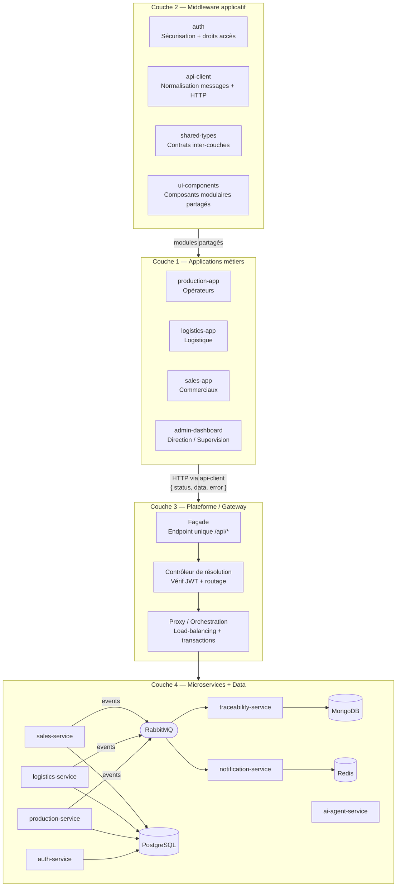

# Architecture Logicielle — Monorepo

Ce document décrit l'architecture SOA/Microservices à 4 couches du projet. Chaque section correspond à une couche définie dans le cahier des charges.

---

## Vue d'ensemble



---

## Structure du Monorepo

```
aeronexis-modular-erp/
├── apps/                    # Couche 1 : Applications métiers
│   ├── production-app/
│   ├── logistics-app/
│   ├── sales-app/
│   └── admin-dashboard/
├── packages/                # Couche 2 : Middleware applicatif partagé
│   ├── auth/                # Sécurisation flux locaux + gestion des droits
│   ├── api-client/          # Normalisation messages + couche HTTP
│   ├── shared-types/        # Contrats inter-couches (types, DTOs, interfaces gateway)
│   └── ui-components/       # Composants UI modulaires interchangeables
├── services/                # Couches 3 & 4 : Plateforme + Microservices
│   ├── api-gateway/         # Couche 3 : Façade, contrôleur de résolution, proxy
│   ├── auth-service/        # Couche 4 : Authentification JWT, RBAC
│   ├── production-service/  # Couche 4 : Ordres de fabrication, lots, incidents
│   ├── logistics-service/   # Couche 4 : Stocks, réservations, expéditions
│   ├── sales-service/       # Couche 4 : Commandes clients, statistiques
│   ├── traceability-service/# Couche 4 : Audit trail immuable (consommateur RabbitMQ)
│   ├── notification-service/# Couche 4 : Alertes temps réel WebSocket (consommateur RabbitMQ)
│   └── ai-agent-service/    # Couche 4 : Prédiction, détection d'anomalies
├── infrastructure/
│   ├── docker/
│   │   └── docker-compose.yml
│   └── monitoring/
│       └── prometheus.yml
└── docs/
    └── architecture/
```

---

## Couche 1 — Applications métiers (`apps/`)

Chaque application correspond à un rôle métier de l'entreprise.

| Application | Rôle | Utilisateurs |
|---|---|---|
| `production-app` | Suivi des ordres de fabrication, lots, incidents | Opérateurs |
| `logistics-app` | Stocks, réservations matières, expéditions | Responsables logistique |
| `sales-app` | Commandes clients, livraisons, KPIs | Commerciaux |
| `admin-dashboard` | Supervision globale, gestion utilisateurs, reporting | Direction |

### Structure interne d'une application (pattern à reproduire)

```
apps/<nom>-app/src/
├── routes/
│   └── index.tsx          # createBrowserRouter + lazy loading + ProtectedRoute
├── api/                   # Couche d'abstraction vers le gateway (bascule DEV/PROD)
│   └── orders.ts
├── hooks/
│   ├── queries/           # useQuery React Query — lecture de données
│   └── mutations/         # useMutation React Query — modification de données
├── pages/                 # Écrans — consomment uniquement des hooks
├── components/
│   ├── layout/            # AppLayout, Sidebar propres au rôle
│   ├── ui/                # Composants graphiques locaux (surcharge de ui-components)
│   └── domain/            # Composants métiers présentationnels
├── data/
│   └── mock.ts            # Données de démo — utilisées si import.meta.env.DEV
├── App.tsx                # Providers : QueryClientProvider + RouterProvider
└── main.tsx
```

**Règle de dépendance** : `pages/` → `hooks/` → `api/` → `@aeronexis-dynamics/api-client`.
Une page ne doit jamais appeler directement `fetch` ou `apiClient`.

**Bascule DEV/PROD dans `api/`** :
```typescript
export async function getOrders(): Promise<WorkOrder[]> {
  if (import.meta.env.DEV) return mockWorkOrders   // données locales, pas de réseau
  const res = await apiClient.get<WorkOrder[]>('/api/production/orders')
  if (res.status === 'failure') throw new Error(res.error?.message)
  return res.data
}
```

---

## Couche 2 — Middleware applicatif (`packages/`)

Modules partagés entre toutes les applications. Ils constituent la couche intermédiaire entre la présentation et la communication avec la plateforme.

| Package | Rôle dans la couche 2 |
|---|---|
| `auth` | Sécurisation des flux locaux : `LoginPage`, `ProtectedRoute`, `useAuthStore` (JWT), `isAuthBypassed` (bypass dev) |
| `api-client` | Normalisation des messages `{ status, data, error }` + injection JWT + gestion des erreurs réseau |
| `shared-types` | Contrats TypeScript inter-couches : entités métier, `ApiResponse<T>`, `NormalizedMessage<T>`, types gateway (`ServiceRoute`, `ResolvedRequest`) |
| `ui-components` | Composants UI modulaires : contrats de props `ButtonProps`, `CardProps`, `BadgeProps` — chaque app fournit son implémentation Tailwind locale |

### Normalisation des messages

Toute communication inter-couches utilise le format `NormalizedMessage<T>` :

```typescript
// packages/shared-types
export interface ApiResponse<T> {
  status: 'success' | 'failure' | 'pending'
  data: T
  error?: { code: string; message: string }
}

// packages/api-client — alias explicite de la couche 2
export type NormalizedMessage<T> = ApiResponse<T>
```

---

## Couche 3 — Plateforme / Gateway (`services/api-gateway/`)

L'API Gateway est le **point d'entrée unique** de toute communication entre les applications et la plateforme. Il est composé de 3 sous-composants internes.

```
services/api-gateway/src/
├── facade/
│   └── gateway.controller.ts  # Façade unique — exposition de tous les services
├── resolver/
│   ├── jwt.guard.ts            # Contrôleur de résolution — vérification JWT
│   └── auth.middleware.ts      # Contrôleur de résolution — extraction des claims
└── proxy/
    └── proxy.service.ts        # Proxy / Orchestration — routage vers microservices
```

### 3.1 Façade (`facade/gateway.controller.ts`)

Expose tous les services de la plateforme via un endpoint unique. Chaque préfixe de route correspond à un microservice de la couche 4 :

| Route | Service cible |
|---|---|
| `POST /auth/login` | `auth-service` (public) |
| `* /api/production/*` | `production-service` |
| `* /api/logistics/*` | `logistics-service` |
| `* /api/sales/*` | `sales-service` |
| `* /api/traceability/*` | `traceability-service` |
| `* /api/notifications/*` | `notification-service` |

### 3.2 Contrôleur de résolution (`resolver/`)

Vérifie les droits utilisateur avant tout routage :
- **`AuthMiddleware`** : extrait et décode le JWT sur toutes les requêtes, attache le payload (`userId`, `role`) à `req.user`
- **`JwtGuard`** : valide le token sur les routes protégées ; rejette avec `401 Unauthorized` si invalide ou absent

### 3.3 Proxy / Orchestration (`proxy/proxy.service.ts`)

Route les requêtes vers le microservice approprié via `express-http-proxy` :
- Maintient la table de routage `ServiceRoute[]` (chargée depuis les variables d'environnement)
- Transmet les en-têtes d'authentification (`x-user`) au service cible
- Normalise les erreurs de communication réseau au format `{ status: 'failure', error: { code: 'PROXY_ERROR' } }`

---

## Couche 4 — Microservices + Data (`services/` + `infrastructure/`)

### Microservices

Chaque microservice est indépendant, conteneurisable et exposé uniquement via le gateway.

| Service | Base de données | Rôle |
|---|---|---|
| `auth-service` | PostgreSQL (`schema: auth`) | Authentification JWT, RBAC, gestion des utilisateurs |
| `production-service` | PostgreSQL (`schema: production`) | WorkOrder, Lot, Material, Incident, HistoryEntry |
| `logistics-service` | PostgreSQL | StockItem, Shipment, réservations de matières |
| `sales-service` | PostgreSQL | SalesOrder, Client, statistiques commerciales |
| `traceability-service` | MongoDB | Audit trail immuable — consommateur RabbitMQ |
| `notification-service` | Redis | WebSocket temps réel — consommateur RabbitMQ |
| `ai-agent-service` | PostgreSQL + MongoDB | Prédiction, détection d'anomalies |

### Schémas Prisma

Les services PostgreSQL utilisent Prisma avec des schémas SQL isolés :
- `auth-service` → `schema.prisma` → schéma SQL `auth`
- `production-service` → `schema.prisma` → schéma SQL `production`

### Communication asynchrone

```
[production-service / logistics-service / sales-service]
        │ publish(event)
        ↓
   [RabbitMQ]
        │
   ┌────┴────┐
   ↓         ↓
[traceability-service]   [notification-service]
  → MongoDB (audit)        → Redis → WebSocket → [clients]
```

### Infrastructure

| Composant | Port | Usage |
|---|---|---|
| PostgreSQL | 5432 | Données métiers structurées |
| MongoDB | 27017 | Audit trail et documents |
| Redis | 6379 | Cache, sessions, WebSocket |
| RabbitMQ | 5672 / 15672 | Broker événements asynchrones |
| Prometheus | 9090 | Scraping métriques `/metrics` |
| Grafana | 3001 | Dashboards de supervision |

---

## Flux de Communication

### Synchrone (HTTP/REST)

```
[App] → NormalizedMessage → api-client → api-gateway (façade)
                                              → AuthMiddleware (claims)
                                              → JwtGuard (vérif)
                                              → ProxyService (routing)
                                              → [microservice cible]
                                              → [base de données]
                                       ← { status, data, error } ←
```

### Asynchrone (Événements RabbitMQ)

```
[microservice métier] → publish(event) → RabbitMQ
                                              → traceability-service → MongoDB
                                              → notification-service → Redis → WebSocket
```

---

## Stack Technique

| Couche | Technologie |
|---|---|
| Couche 1 — Front-end | React 18 + TypeScript + Vite + Tailwind CSS |
| Couche 2 — Packages | TypeScript, Zustand, React Query, React Router |
| Couche 3 — Gateway | Node.js + NestJS + express-http-proxy + JWT |
| Couche 4 — Microservices | Node.js + NestJS + Prisma |
| Couche 4 — Agent IA | Python + FastAPI |
| Base SQL | PostgreSQL 15 + Prisma (multi-schema) |
| Base NoSQL | MongoDB 6 |
| Cache / Temps réel | Redis 7 |
| Message broker | RabbitMQ 3 |
| Monitoring | Prometheus + Grafana |
| Conteneurisation | Docker + Docker Compose |

---

## Guide de contribution

### A. Ajouter un type ou une entité métier

**Fichier :** `packages/shared-types/src/index.ts`

Déclarer l'interface et ses types de statuts. Importable dans toute app ou service :
```typescript
import type { MonType } from '@aeronexis-dynamics/shared-types'
```

---

### B. Ajouter un endpoint back-end et l'exposer au front

1. **Service** (couche 4) — implémenter dans `services/<nom>-service/src/`
2. **Gateway** (couche 3) — ajouter la route dans `src/facade/gateway.controller.ts` et le mapping dans `src/proxy/proxy.service.ts`
3. **Fonction API** (couche 2→1) — ajouter dans `apps/<app>/src/api/<domaine>.ts` :
```typescript
export async function getMaDonnee(): Promise<MaType[]> {
  if (import.meta.env.DEV) return mockMaDonnee
  const res = await apiClient.get<MaType[]>('/api/<service>/ma-route')
  if (res.status === 'failure') throw new Error(res.error?.message)
  return res.data
}
```
4. **Hook** — créer dans `apps/<app>/src/hooks/queries/useMaDonnee.ts`
5. **Page** — consommer le hook (jamais appeler `apiClient` directement)

---

### C. Ajouter une page dans une application

1. Créer `apps/<app>/src/pages/MaPage.tsx`
2. Ajouter avec lazy loading dans `apps/<app>/src/routes/index.tsx` :
```tsx
const MaPage = lazy(() => import('@/pages/MaPage').then((m) => ({ default: m.MaPage })))
{ path: '/ma-route', element: <Suspense fallback={<Loading />}><MaPage /></Suspense> }
```

---

### D. Ajouter un composant

- **Graphique pur** → `src/components/ui/` (surcharge de `@aeronexis-dynamics/ui-components`)
- **Métier présentationnel** → `src/components/domain/` (reçoit des props, n'appelle pas de hooks)
- **Interchangeable entre apps** → `packages/ui-components/src/` (contrat de props)

---

### E. Ajouter un microservice (couche 4)

1. Créer `services/<nom>-service/` avec `package.json` (`@aeronexis-dynamics/<nom>-service`)
2. Initialiser NestJS + Prisma (voir `auth-service` comme référence)
3. Ajouter dans `docker-compose.yml` (image, ports, réseau `aeronexis-network`)
4. Ajouter la cible dans `prometheus.yml`
5. Ajouter les types dans `packages/shared-types/src/index.ts`
6. Brancher les routes dans `services/api-gateway/src/facade/gateway.controller.ts`
7. Ajouter l'URL dans `services/api-gateway/src/proxy/proxy.service.ts`

---

### F. Ajouter une nouvelle application (couche 1)

1. Ajouter le rôle dans `packages/shared-types/src/index.ts` → type `Role`
2. Créer `apps/<nom>-app/` en copiant la structure de `production-app`
3. Déclarer les dépendances `@aeronexis-dynamics/auth`, `api-client`, `shared-types`
4. Créer `.env.development` avec `VITE_AUTH_BYPASS=true`
5. Ajouter le rôle dans la logique RBAC de `services/auth-service/`

---

### G. Étendre les mocks de développement

**Fichier :** `apps/<app>/src/data/mock.ts`

Les types importés depuis `@aeronexis-dynamics/shared-types` assurent la cohérence. Les fonctions `api/` basculant sur `import.meta.env.DEV` récupèrent automatiquement les nouvelles données.

---

## Développement local

| Variable | Valeur | Effet |
|---|---|---|
| `VITE_AUTH_BYPASS=true` | `.env.development` | Accès direct aux routes protégées ; utilisateur mock injecté (`packages/auth`) |
| `VITE_AUTH_BYPASS=false` | test du flux login | Comportement production : redirection vers `/login` si pas de token |

```bash
# Démarrer l'infrastructure (base de données, RabbitMQ, monitoring)
docker compose -f infrastructure/docker/docker-compose.yml up -d

# Lancer l'application front-end
cd apps/production-app && npm run dev

# Lancer un microservice (après npm install + prisma migrate)
cd services/auth-service && npm run start:dev
```

---

## Sécurité et Scalabilité

- Les microservices ne sont **jamais exposés directement** : toutes les requêtes passent par l'`api-gateway` (couche 3)
- L'authentification repose sur des **JWT** validés par le `JwtGuard` à chaque requête protégée
- Les droits sont contrôlés par **RBAC** (rôles : `operator`, `logistics`, `sales`, `director`, `admin`)
- Chaque service est **conteneurisé indépendamment** et peut être scalé horizontalement
- Le découplage via **RabbitMQ** absorbe les pics de charge sans blocage synchrone
- Les secrets sont gérés exclusivement par **variables d'environnement**, jamais versionnés
