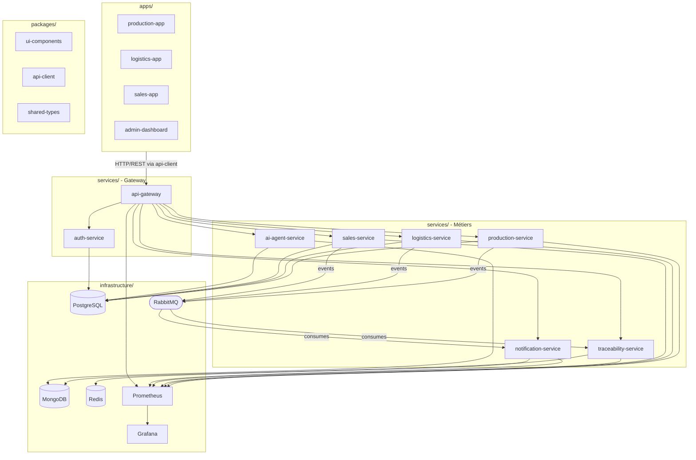

# Architecture Logicielle - AERONEXIS Dynamics

## Structure du Monorepo

```
aeronexis-modular-erp/
├── apps/                    # Applications front-end par rôle
│   ├── production-app/
│   ├── logistics-app/
│   ├── sales-app/
│   └── admin-dashboard/
├── packages/                # Librairies partagées
│   ├── ui-components/
│   ├── api-client/
│   └── shared-types/
├── services/                # Microservices back-end
│   ├── api-gateway/
│   ├── auth-service/
│   ├── production-service/
│   ├── logistics-service/
│   ├── sales-service/
│   ├── traceability-service/
│   ├── notification-service/
│   └── ai-agent-service/
├── infrastructure/
│   ├── docker/
│   │   └── docker-compose.yml
│   ├── databases/
│   │   ├── sql/             # Scripts de migration PostgreSQL
│   │   └── nosql/           # Scripts d'initialisation MongoDB
│   └── monitoring/
│       └── prometheus.yml
└── docs/
    ├── architecture/
    ├── api/
    └── user-stories/
```

---

## Diagramme des Composants



---

## Rôle des Composants

### `apps/` - Applications Front-end

| Dossier | Rôle |
|---|---|
| `production-app` | Interface opérateur : consultation des ordres de fabrication, suivi d'avancement des lots, signalement d'incidents |
| `logistics-app` | Interface logistique : suivi des stocks, réservations de matières, planification des expéditions |
| `sales-app` | Interface commerciale : suivi des commandes, validation des commandes urgentes, statistiques clients |
| `admin-dashboard` | Interface de supervision : KPIs consolidés, gestion des utilisateurs, rapports d'incidents, monitoring des flux |

### `packages/` - Librairies Partagées

| Package | Rôle |
|---|---|
| `ui-components` | Bibliothèque de composants graphiques réutilisables entre toutes les applications (boutons, formulaires, tableaux, badges de statut) |
| `api-client` | Couche d'abstraction pour les appels HTTP/WebSocket : normalisation des messages au format `{ status, data, error }`, gestion des tokens, retry automatique |
| `shared-types` | Contrats de données TypeScript partagés entre front-end et back-end : interfaces, DTOs, énumérations de statuts |

### `services/` - Microservices Back-end

| Service | Rôle | Base de données |
|---|---|---|
| `api-gateway` | Endpoint unique : routage des requêtes, délégation de l'auth, load-balancing, rate-limiting | — |
| `auth-service` | Authentification JWT, contrôle RBAC, gestion des sessions | PostgreSQL |
| `production-service` | CRUD ordres de fabrication et lots, gestion des incidents, émission d'événements RabbitMQ | PostgreSQL |
| `logistics-service` | Gestion des stocks, réservations de matières, expéditions, alertes de rupture via RabbitMQ | PostgreSQL |
| `sales-service` | Cycle de vie des commandes, dates de livraison, statistiques commerciales | PostgreSQL |
| `traceability-service` | Consommateur d'événements RabbitMQ : audit trail immuable et horodaté, API de recherche d'historique | MongoDB |
| `notification-service` | Consommateur d'événements RabbitMQ : envoi WebSocket aux clients connectés, file de notifications non lues | Redis |
| `ai-agent-service` | Automatisation et optimisation des processus (prédiction, détection d'anomalies) | PostgreSQL + MongoDB |

### `infrastructure/`

| Composant | Type | Usage |
|---|---|---|
| **PostgreSQL** | SQL | Données métiers structurées (ordres, lots, stocks, commandes, utilisateurs) |
| **MongoDB** | NoSQL | Audit trail et historique d'événements (traceability-service) |
| **Redis** | In-memory | Cache, sessions WebSocket, file de notifications |
| **RabbitMQ** | Message broker | Communication asynchrone inter-services via publish/subscribe |
| **Prometheus** | Monitoring | Scraping des métriques exposées par chaque service sur `/metrics` |
| **Grafana** | Observabilité | Dashboards de supervision basés sur les métriques Prometheus |

---

## Flux de Communication

### Synchrone (HTTP/REST)

```
[App] → api-client → api-gateway → auth-service (validation token)
                                 → [service cible] → [base de données]
                                 ← { status, data, error } ←
```

### Asynchrone (Événements)

```
[production-service / logistics-service / sales-service]
        │ publish(event)
        ↓
   [RabbitMQ]
        │
   ┌────┴────┐
   ↓         ↓
[traceability-service]   [notification-service]
  → MongoDB (audit)        → Redis → WebSocket → [clients]
```

---

## Stack Technique

| Couche | Technologie |
|---|---|
| Front-end | React + TypeScript |
| Back-end (services) | Node.js + NestJS |
| Agent IA | Python + FastAPI |
| Base SQL | PostgreSQL 15 |
| Base NoSQL | MongoDB 6 |
| Cache / Temps réel | Redis 7 |
| Message broker | RabbitMQ 3 |
| Monitoring | Prometheus + Grafana |
| Conteneurisation | Docker + Docker Compose |

---

## Sécurité et Scalabilité

- Les microservices ne sont pas exposés directement : toutes les requêtes passent par l'`api-gateway`.
- L'authentification repose sur des **JWT** validés par l'`auth-service` à chaque requête.
- Les droits d'accès sont contrôlés par **RBAC** (rôles : opérateur, logistique, commercial, direction, admin).
- Chaque service est **conteneurisé indépendamment** et peut être scalé horizontalement.
- Le découplage via **RabbitMQ** absorbe les pics de charge sans blocage synchrone.
- Les secrets sont gérés exclusivement par **variables d'environnement**, jamais versionnés.
